#  *kilka słów o różach*                  

 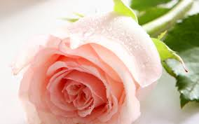

:bangbang: **Róża, to jeden z najpiękniejszych rodzajów wśród krzewów, którego zalety doceniono już w starożytności i od tamtego czasu, róża zajmuje czołowe miejsce wśród roślin ozdobnych, nazywana często „królową kwiatów”. Róże występują w całej strefie umiarkowanej półkuli północnej i mają postać krzewów, bardzo zróżnicowanych, zależnie od gatunku. Ich wysokość waha się od piętnastu centymetrów, do nawet dziesięciu metrów u form pnących. Pędy wzniesione, czepne lub płożące się, uzbrojone mniej lub licznej w kolce. Kwiaty promieniste, podwójne, półpełne lub pełne w wszystkich barwach, za wyjątkiem czysto niebieskiej. Tysiące odmian róż, jakie są obecnie dostępne, możemy pogrupować na kilka grup.**


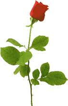       

## Grupy róż

**W ogrodnictwie, ze względu na pokrój i zastosowanie róże dzieli się na 7 grup:**

**_1. Róże wielkokwiatowe:_**
 - Krzewy o wysokości od 0,5 do 1,5 m. Podczas kwitnienia posiadają duże pąki o pięknym kształcie, rozwijają się w ogromne kwiaty o przeróżnych barwach. Najliczniejsza i najważniejsza grupa odmian przeznaczonych do ogrodów oraz do uprawy na kwiat cięty.:rose:

**_2. Róże rabatowe:_**
 - Krzewy niższe od róż wielkokwiatowych. Silnie się krzewią oraz obficie kwitną od wiosny do późnej jesieni. Są wytrzymałe na niskie temperatury, długowieczne i bardziej odporne na choroby.:rose:

**_3. Róże pnące:_**
 - Krzewy o długich pędach, dochodzących do 6-8 m. Nie mają organów czepnych, należy je przywiązywać do podpór. Kwitnie obficie. Sadzi się je przy pergolach, altanach, ścianach.:rose:

**_4. Róże parkowe:_**
 - Krzewy silnie rosnące, o pędach prostych i ukośnych, dochodzących do wysokości 2,5 m. Kwitnie obficie, raz w roku. Kwiaty są pojedyncze, półpełne lub pełne, często o intensywnym zapachu.:rose:

**_5. Róże pienne:_**
 - Nie stanowią odrębnej grupy odmian. Są to krzewy odmian szlachetnych wyprowadzone w formie drzewka. Powstają w wyniku okulizacji lub szczepienia na specjalnie wyprowadzonych pionowo pędach.:rose:
 
**_6. Róże okrywowe:_**
 - Silnie się krzewią. Z pędów i liści tworzą zwartą okrywę z pędów i liści. Kwitnie obficie i długo.:rose:

**_7. Róże miniaturowe:_**
 - Pochodzą od róży chińskiej odmiany niskiej – Rosa chinensis minima. Delikatne, niskie krzewy o małych kwiatach i drobnych liściach. Wrażliwe na niskie temperatury. Wymagają kopczykowania. Często wykorzystywane do dekoracji wnętrz.:rose:


:link: Jesli chcesz dowiedzieć się więcej o różach, odwiedź strony:  http://poradnikogrodniczy.pl/roze.php , http://www.zielonyogrodek.pl/przycinanie-roz-po-co-kiedy-i-jak-przycinac-roze


  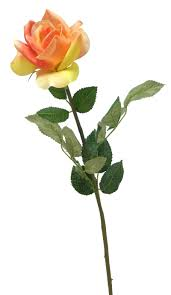              
  
:heart:  :heart: :heart:    :heart:  :heart: :heart:  :heart:  :heart: :heart:  :heart:  :heart: :heart:   


|      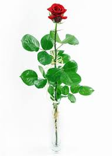 |       <h3>
Ach ta róża! ach ta róża!<h3>
Co się w twoje okno wdziera,<h3>
Na pokusy mnie wystawia,<h3>
Sen i spokój mi odbiera…<h3>
<h6> Autor: Adam Asnyk, Róża   |   |
| ---------- |----------------| ---------|
||  | |
|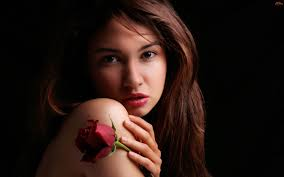 | |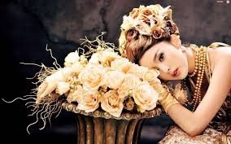|
| | 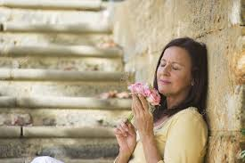||


 

# Kobiety lubią róże


|      |          |   |
| ---------- |----------------| ---------|
||  | |
| | ||
| | ||
 


> # Kobiety są jak róże: niby zupełnie do siebie podobne, a jednak zapach, forma i kolor każdej z nich jest trochę inny.

## Autor: Alfred Aleksander Konar
 
 :rose: :rose:    :heart:  :rose: :rose:     :rose: :rose:     :rose: :rose:     :rose: :rose:    :heart:  :rose: :rose:     :rose: 
 
 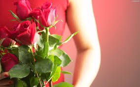    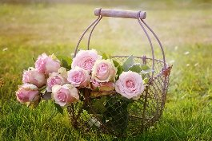


# Propozycje poczty kwiatowej:
| Bukiet      | Opis           | Zdjęcie  |Cena|
| ---------- |----------------| ---------|----|
|"Białe róże"|Elegancja klasycznych białych róż jest niepodważalna. Niezależnie od pory roku czy okazji , bukiet z 9 białych róż to doskonały wybór! Do bukietu możesz dołączyć bilecik.|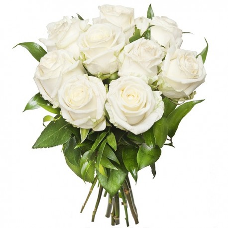|~~79zł~~ **70zł**|
|"Herbaciane róże" | To kolor słońca i radości , wyzwala dobrą energię i ciepło. Wyślij więc online bukiet 15 herbacianych róż z zielonym przybraniem. Do bukietu dołącz bilecik i napisz życzenia.| 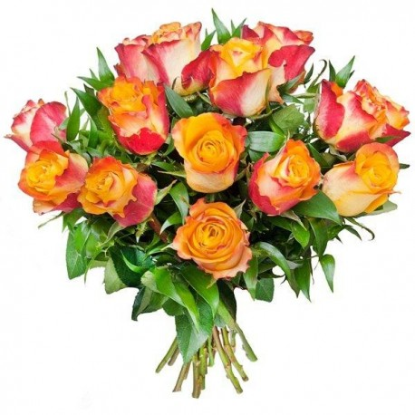|113zł|
|"Róże w pudełku"|Proponujemy Państwu nasz nowy HIT, 9 czerwonych róż w białym kwadratowym, kartonowym pudełku. Kwiaty będą trzymać się bardzo długo ponieważ ułożone zostały w gąbce florystycznej umieszczonej w plastikowym pojemniku.Do kwiatowego prezentu możesz dołączyć gratis bilecik.|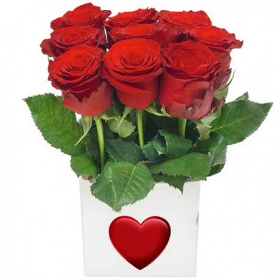|~~90zł~~ **80zł**|
|"Zielone róże z zieloną herbatą"|Zielony kolor symbolizuje również ...rodzącą się miłość! Jest to barwa nadziei na szczęście. Wyślij on Line 11 zielonych róż przybranych pachnącym szarym eukaliptusem i dołącz zieloną herbatę. Do przesyłki można dodać bilecik i przekazać życzenia.|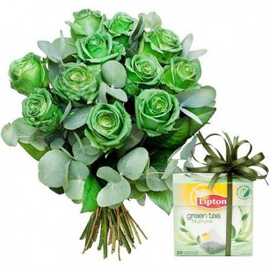|113zł|


:link: Jesli chcesz zobaczyć więcej propozycji, odwiedź stronę:  http://kwiatyonline.com.pl/pl/, https://www.kwiatowaprzesylka.pl/#!/home

:heart: :heart: :heart: :heart: :heart: :heart: :heart: :heart: 


****

 
 
:heart: :heart: :heart: :heart: :heart: :heart: :heart: :heart: :heart: :heart: :heart: :heart: :heart: :heart: :heart: :heart: 


## Programy w języku C, który wydrukuje wiersz:


```c
#include <stdio.h>
int main() {
  printf("Nie rusz Andziu, tego kwiatka,\n");
  printf("Róża kole, rzekła matka.\n");
  printf("Andzia mamy nie słuchała,, \n");
  printf("Ukłuła się i płakała.\n");
  printf("\n");
  printf("Autor: Stanisław Jachowicz, Powiastki i bajki. Andzia, 1842\n");
  return 0;
}
```
:rose: :rose:    :heart:  :rose: :rose:     :rose: :rose:     :rose: :rose:     

# *z bloga Klaudyny Herdy*
RÓŻANY ELIKSIR SZCZĘŚCIA.


>Tak jak obiecałam, będziemy mówić o przeróżnych pomysłach na płatki róży. Na pewno kojarzycie zastosowanie kosmetyczne (zapachy różane, różany olejek, wodę z kwiatów róży), na pewno znacie zastosowanie kulinarne (pyszne konfitury!), ale czy wiecie, że płatki róży mają właściwości lecznicze?

>Dziś zapraszam Was do przygotowania ze mną różanego eliksiru szczęścia. Nazwałam go tak nie tylko dlatego, że pięknie wygląda i od razu przywołuje na twarz uśmiech i wspomnienia z dzieciństwa: jest w tym coś więcej!

>Zapraszam!

>Zastosowania lecznicze płatków róży

>Róża ma mnóstwo zastosowań leczniczych – naturalny olejek różany to jeden z najcenniejszych, najdroższych i najbardziej pożądanych olejków aromaterapeutycznych. Róża jako lekarstwo była stosowana od bardzo, bardzo dawna, jednak jej użycie rozsławili Arabowie, zwłaszcza Awicenna, który polecał wodę różaną na wiele dolegliwości (było to swoiste panaceum).

>Obecnie wiemy, że olejek różany (oraz oczywiście nasze pięknie pachnące różane płatki!) szczególnie dobrze sprawdzają się w przypadku problemów z sercem, nastrojem, melancholią. Róży używa się w przypadku przygnębienia, lekkiej depresji, nerwicy, permanentnego stresu, żałoby, złamanego serca i bólu emocjonalnego.

>Każdy z nas ma takie chwile w życiu, kiedy wszystko wokół wydaje się szare i pozbawione większego znaczenia. Wtedy, jak balsam na zbolałe serce, można sięgnąć po różę.

>Właśnie dlatego nazwałam dzisiejszą preparację eliksirem szczęścia: wystarczy odkręcić wieczko, wchłonąć upajający zapach róż, wypić łyżkę i odczekać chwilkę.  Świat znów nabierze kolorów.


:smile::rose::star::sunny::kiss::boom: :heart:  :rose:
:smile::rose::star::sunny::kiss::boom: :heart:  :rose:
:smile::rose::star::sunny::kiss::boom: :heart:  :rose:
:smile::rose::star::sunny::kiss::boom: :heart:  :rose:

## Różany eliksir szczęścia krok po kroku. 

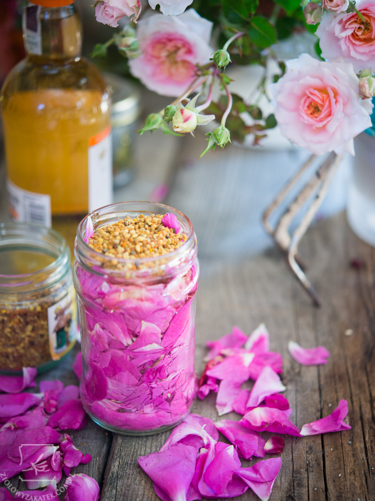

*Przygotowanie różanego eliksiru jest bardzo proste. Będziemy potrzebować alkoholu, miodu (działanie wzmacniające) oraz płatków róży. Teoretycznie każda róża jest jadalna i każda ma jakieś właściwości lecznicze, ale najlepsze są róże mocno pachnące – zwłaszcza stulistna, galicyjska, damasceńska. Mają największe stężenie substancji czynnych (głównie jest to cytronellol i geraniol), najpiękniejszy zapach i najlepsze właściwości. Do eliksiru dodałam również pyłku pszczelego, który jest świetnym produktem wzmacniającym, zwłaszcza w sytuacjach stresogennych. Można pominąć jego dodatek.*

*Jeśli z jakiegokolwiek powodu nie chcecie lub nie możecie używać miodu, można zastąpić go gliceryną roślinną, tworząc prosty gliceryt.*

#### :kiss:Krok pierwszy


Płatki róż płuczemy pod bieżącą wodą, wkładamy do wyparzonego słoiczka.

#### :kiss:Krok drugi

Dodajemy tyle miodu, aby mniej-więcej zakryć płatki, mieszamy całość łyżką.


#### :kiss:Krok trzeci

Dodajemy dwie łyżki pyłku pszczelego

#### :kiss:Krok czwarty

Całość zalewamy alkoholem (użyłam żołądkowej gorzkiej – płatki są dość delikatne, nie polecałabym stężenia większego niż 60%). Upewniamy się, czy płatki są w całości przykryte. Jeśli się „skompresowały”, dodajemy jeszcze trochę świeżych. Dokładnie mieszamy.

#### :kiss:Krok piąty

Zakręcamy szczelnie słoik, przechowujemy go w ciemnym chłodnym miejscu przez 5-6 tygodni. Codziennie potrząsamy słoiczkiem, żeby składniki ładnie się wyekstrahowały. Podczas maceracji syropu zrobi się trochę mniej (wchłoną go płatki), moim zdaniem można dodać wtedy jeszcze trochę wódki, co tam. Po tym czasie przecedzamy eliksir: płatki można zjeść lub dodać np. do jogurtu, zaś sam płyn najlepiej przechowywać w ciemnej buteleczce, w chłodnym miejscu.

W razie potrzeby, kiedy czujemy się dobici albo nieszczęśliwi, sięgamy po eliksir różany i spożywamy co najmniej 2-3 łyżki dzienni

 
>To tyle!

>Pomysł piękny, prosty w wykonaniu i bardzo sympatyczny. Poza tym, czy róża nie jest piękna?

:link: Jeśli kochacie różę albo znacie kogoś, kto również ją kocha, podajcie dalej  http://klaudynahebda.pl/roza-jadalna-przepis/


:smile::rose::star::sunny::kiss::boom: :heart:  :rose:
:smile::rose::star::sunny::kiss::boom: :heart:  :rose:
:smile::rose::star::sunny::kiss::boom: :heart:  :rose:
:smile::rose::star::sunny::kiss::boom: :heart:  :rose:

### Sprawdzamy czy posiadamy wszystkie składniki


- [x] alkohol
- [x] miód
- [x] płatki róży
- [ ] pyłek pszczeli
- [x] zakrecany szczelnie słoik


:sunny: :sunny: :sunny::sunny::sunny::sunny::sunny::sunny::sunny::sunny::sunny::sunny::sunny::sunny::sunny::sunny:


# Rozarium
Rozarium (łac. rosarium), różanka, ogród różany – ogród lub jego część, gdzie uprawiane i eksponowane są kolekcje róż. Rozaria cechują się zwykle bogactwem kultywarów tego rodzaju. W Europie rozaria istniały od średniowiecza, a rozpowszechniły się w XIX wieku. Za jeden z pierwszych wyspecjalizowanych ogrodów różanych uważany jest ten założony przez pierwszą żonę Napoleona Bonaparte Joséphine de Beauharnais w La Malmaison (Francja). W chwili jej śmierci, w 1814 roku, w ogrodzie, prezentowane zarówno w donicach jak i na rabatach, rosło około 400, czyli wszystkie dostępne wówczas odmiany róż[1]. Obecnie w dalszym ciągu istnieje tam rozarium, jednak ma ono niewiele wspólnego ze swoim słynnym pierwowzorem. O ile w ciągu XIX wieku róże uprawiano zwykle w rozariach, w ciągu XX wieku ich znaczenie zmalało, a róże znalazły zastosowanie w urządzaniu rozmaitych terenów zielonych.

Ogrody różane mają zazwyczaj geometryczną, prostolinijna architekturę. Składają się z zespołu rabat, najczęściej o regularnych, geometrycznych kształtach. Na każdej rabacie uprawiane są róże dobrane tak, by zachować harmonię kolorystyczną kwiatów. Między rabatami umieszczane są pergole, łuki i trejaże pozwalające na ekspozycję odmian pnących.

Rosarium w Wojewódzkim Parku Kultury i Wypoczynku w Chorzowie (woj. ślaskie) jest największe w Polsce i jedno z większych w Europie. Posadzonych jest tam około 30 tysięcy róż. Ciekawą kolekcję róż posiada również Ogród Botaniczny w Łodzi, Ogród Botaniczny PAN w Powsinie, ogród różany w Szczecinie czy w Wilanowie.
Inne warte polecenia rosaria na świecie: Europa-Rosarium w Sangerhausen (Niemcy), Roseraie du Val-de-Marne (Francja), ogród różany przed klasztorem misyjnym Santa Barbara( Kalifornia, USA), kolekcja róż w Hyde Hall (hrabstwo Essex na wschód od Londynu).


:smile::rose::star::sunny::kiss::boom: :heart:  :rose:
:smile::rose::star::sunny::kiss::boom: :heart:  :rose:
:smile::rose::star::sunny::kiss::boom: :heart:  :rose:
:smile::rose::star::sunny::kiss::boom: :heart:  :rose:


## Rozarium w Chorzowie
Obszar o powierzchni ponad siedmiu hektarów, to jeden z największych symboli Parku Śląskiego. Rosarium najpiękniej kwitnielatem, gdy setki tysięcy krzewów mieni się przepięknymi kolorami, a niektóre, jak frezje, wydzielają charakterystyczny, kuszący wręcz zapach.

Parkowe Rosarium to układ zamknięty w tzw. plastrze miodu. Składają się na niego 374 rabatki w kształcie komórek o powierzchni 7,5 metra kwadratowego. Poza tym, w ogrodzie jest 15 dużych rabat w kształcie soczewek, które mają od 75 do 350 metrów kw. Cała kolekcja róż liczy około trzystu odmian, które można podziwiać na około 35 tysiącach krzewów.Róże najintensywniej kwitną od połowy czerwca do połowy lipca. Potem, z mniejszą intensywnością, powtarzają ten proces aż do jesieni.

>Lato to dla Rosarium taki szczególny okres. Goście wiedzą już bowiem, że róże wyglądają wtedy najpiękniej i chętnie odwiedzają nasz ogród - przyznaje Łukasz Drozd, który nadzoruje pielęgnację parkowej zieleni. Stałą popularnością cieszy się róża rugosa. Jej płatki wykorzystywane są do konfitur, kosmetyków i kąpieli. Jednak nie wolno ich zrywać z kwiatów. Należy zaczekać aż opadną – mówi. Większość odmian róż w Parku Śląskim to produkty krajowe oraz europejskich hodowców. Każdego roku ogrodnicy starają się poszerzać kolekcję.Ze względu na zimotrwałość, zakupujemy tylko odmiany najodporniejsze. Niektóre z naszych róż mają ponad 25 lat – przyznaje Drozd.

:link: Jesli chcesz dowiedzieć się więcej o tym parku, odwiedź stronę:  http://www.parkslaski.pl/

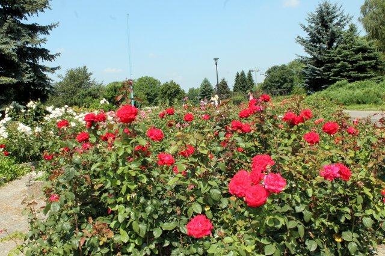
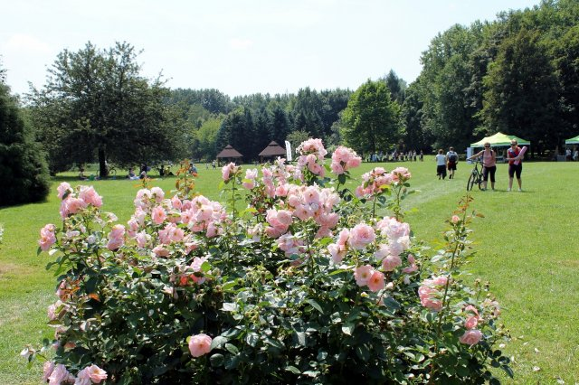
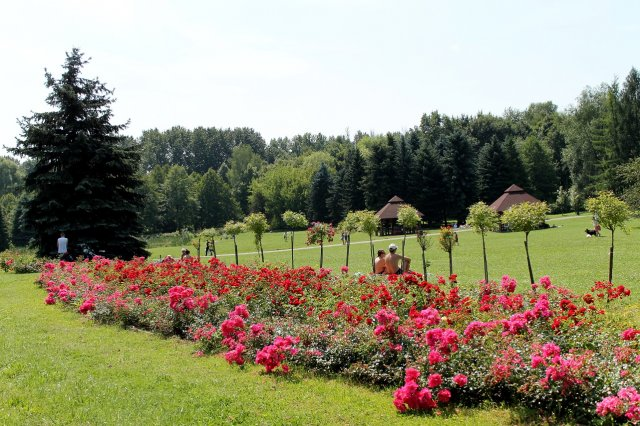
